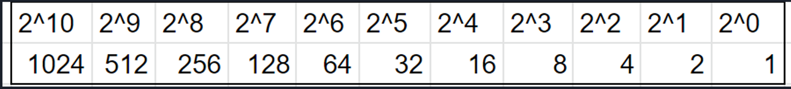
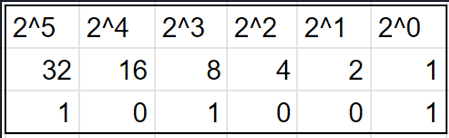
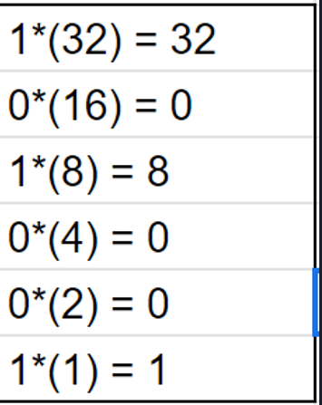
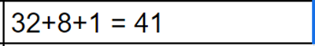

# Binary to Decimal

Converting from decimal to binary is all about understanding the powers of two.
## Here is the powers of 2 up until the 10th power.

Once you have the powers, the next step is to line up the Binary Code to the powers of 2.
### Here is an example of lining up binary to the powers.

Once the binary is lined up to the powers of 2, you are then going to multiply the one or the zero by the power result.
### Here is an example of what the multiplication looks like.

Once all the numbers are multiplied, you then add them up.
### Using the example above here is the final answer.

